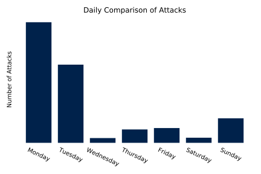

# Remote Access Attack Report

## Overview
In this project, I worked to analyze my log files from my desktop that I have enabled RDP on so I can remote into it. I took an Information Security class in the Fall of 2019. 
As part of that, I looked at my logs for my computer. In the process, I found out I was dealing with a lot of remote access attempts. 
In each case it looked like the attacker(s) had the goal of gaining access to an unsecured device. 
I decided after looking at the logs this didn't pose a risk to my security, but I decided to expand the max size of my log files just to be able to track this. 
I left the logs alone from 10/23/2019 to 5/11/2020 and just recently looked at them again. 
I was shocked to find that I had around 4.5 million events logged where they were failed logins. 
I decided to take a deeper look at the data and see what trends there were for me to tease of out it. 
First, I blocked the port in question so as to ensure my data would be the complete set.

I started by taking the log files which had around 4.5 million log entries of attempted (and failed) logins. It was a csv which was around 8gb raw but formatted in such a way that analysis was...problematic. Thus, I had to convert the data to a format that I could work with (ideally while reducing the size.)
I went ahead and reduced it to just the elements I thought were impoortant for my analysis. I've included that python script [prep.py](https://github.com/kyleashburn/remote_access_attacks/blob/main/prep.py.py) in the repo and then I did the analysis of the data in jupyter notebooks. I would have included my data but github has a max file size of 100mb so my files were too large. I did include a reduced subset so you could see the format of my data [before](https://github.com/kyleashburn/remote_access_attacks/blob/main/data/6_raw.txt) and [after processing](https://github.com/kyleashburn/remote_access_attacks/blob/main/data/6_transformed.txt).

I started with 5 questions and added a 6th one as I went along. In the course of my analysis [documented in the ipynb](https://github.com/kyleashburn/remote_access_attacks/blob/main/Remote%20Access%20Attacks-checkpoint-checkpoint.ipynb) I got a good idea about most of these.

### Questions
**1. Where are the attacks coming from?
I want to have an idea of where these attacks are originating; I want to know if there are countries that are "safe" that I don't have to block access from automatically.**

 In terms of raw countries, they're coming from the Russian Federation, the Netherlands, Switzerland, the United States, Argentina, Sweden, Vietnam, China, the United Kingdom, France, the Republic of Korea (South Korea), Ukraine, Latvia, and Panama.
 
 
 
 Roughly speaking, around half of the IP address are in Russia amd it looks like 82% of the attacks originate from a Russian IP.
 
 

Looking at the trend data over time, it's immediately clear that a lot of the attacks occured over just three days in December of 2019. Those three days are the 29th, the 30th, and the 31st with 295,285, 1,963,501,and 1,253,876 attacks occuring on those days respectively. That adds up to roughly 7/9ths of all of the attacks.

**2. How often does it happen? Is there a pattern to these attacks? Do they occur with greater frequency during the week or weekend? Do they occur with greater frequency during certain hours? Or is the frequency the same? Further, how has the trend of these attacks gone over time? Does it increase, decrease, or stay the same?**

 On average, there was an attack occurring around every 4 seconds when looking at the entire dataset. But, there are serious issues with the distribution of the data that preclude making any broad statements. Roughly 7/9ths of the attacks occurred over a three day period so that skews the data in ways that it is difficult to account for.

 Looking at the hourly breakdown over time, there is a clear drop in the number of attacks recorded between noon and 7pm.
 
 
 
 Looking at the daily breakdown, over the whole dataset, there is a clear focus on Monday and Tuesday as the days of the weeek when attacks occur.
 
 

 Looking at the trend data over time, it's immediately clear that a lot of the attacks occured over just three days in December of 2019. Those three days are the 29th, the 30th, and the 31st with 295,285, 1,963,501,and 1,253,876 attacks occuring on those days respectively. That adds up to roughly 7/9ths of all of the attacks.
 
 

**3. How many names are tried?
How many usernames are tried by these attackers? Further, how many are repeated? Is it the same list that is repeated over and over just from a different IP address? Or does it appear to be a different list?**

 92,880 unique names were tried. It looks like the different attackers are using different dictionaries. There is overlap in what the names are that are being tried but that speaks more to the targets of the attackers I believe.

**4. What are the top names tried?**
 
 Top Ten Names:

1."ADMINISTRATOR": 274205 attempts

2."ADMIN": 59295 attempts

3."USER": 16123 attempts

4."SERVER": 11301 attempts

5."REMOTE": 10875 attempts

6."USER1": 7138 attempts

7."Administrator: 5354 attempts

8."BACKUP": 3970 attempts

9."ADMINISTRADOR": 3537 attempts

10."SUPPORT": 3326 attempts

It's quite clear that the target tends toward the administrative here. The top 10 attempted usernames make up around 9% of the total login attempts.

**5. Are only null passwords attempted?**
Do the attackers ever attempt to use a password that isn't null? Or do they stick with just trying to find unprotected accounts?

 Yes, only null passwords are attempted. The attackers show no interest in gaining access to an account which is secured.

**6. What sorts of workstations are launching these attacks?**

 Unfortunately, in the vast majority of these attacks, the workstation type was not collected. It works out to only around a fifth of a percent of all attacks. In three cases which I'm taking to be mistakes, the machine carrying out the attack had the same name as my computer...so I'm inclined to say there's not much data to be pulled out of here.

### Limitations
There were a number of limitations here that limit the degree to which I can say things with any certainty. Because a large number of the attacks occured on just three days, that means my dataset is heavily skewed and thus it's hard to make any claims about the days of the week when hours occur.

